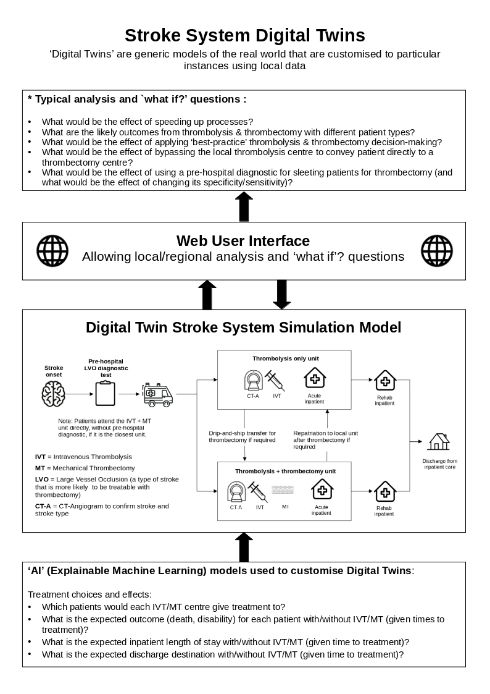

# STROKE-TWIN: Optimising flow and patient outcomes in the emergency stroke pathway using Stroke System Digital Twins

## Plain English Summary

AIM

This research aims to reduce life-altering differences in emergency stroke care by identifying and addressing hospital-level variations in the use of proven clot-removing treatments. We will combine multiple modern 'AI' technologies into what is called a 'Digital Twin'. A Digital Twin in our case is a model that can mimic the behaviour of any regional stroke system in England or Wales. The Digital Twins will be made available to the stroke community to use as a web application. This 'app' will allow users to ask 'what if?' questions to help them understand how care may be best improved in their region. This will pave the way for targeted interventions to improve patient outcomes and streamline healthcare resources.

BACKGROUND

Our team performs a range of advanced methods to understand variation in emergency stroke care, especially the removal of clots causing the stroke, and the effect that variation has on patient outcomes. We map access to different types of care depending on where people live. We have models that mimic the flow of patients through each hospital, and can identify for each hospital how improving that flow could improve patient outcomes. Using 'explainable machine learning' we also learn the characteristics of patients each hospital will, or will not, give clot-busting drugs to (to remove the blockage causing a stroke). Differences in decisions are a major cause of variation in treatment, and understanding these differences will help reduce this variation and improve outcomes.

PLANNED WORK

We wish to build on our current work in several important ways:

1. We will extend our work to cover mechanical removal of clots ('thrombectomy'). We will look at variation in the access to, and speed of, thrombectomy. We will compare decisions on which patients are selected for thrombectomy.

2. We will update our analysis to include new stroke care guidelines. This includes extending use of clot-busting drugs to more people who wake up having had a stroke in their sleep, or who present at hospital late, up to 9 hours after their stroke.

3. We will investigate how variation in treatment is affecting in-patient lengths of stay (which affects both the patients and the hospitals who provide the inpatient care).

4. We will pull all the work together in a single model called a 'Digital Twin'. People may select which hospital or region they wish the Digital Twin to mimic, and ask 'what if?' questions.

5. We have just launched a web app that allows stroke teams to see our analysis (https://stroke-predictions.streamlit.app/). We will continue to refine this app, and will expand it with all the new analyses.

During this project we will hold stakeholder workshops to obtain feedback on the work, to ensure our work engages stroke teams.

PUBLIC AND PATIENT INVOLVEMENT

We work with a highly engaged Patient and Public Involvement team. This team has been key in pushing the project to focus on outcomes and not just NHS targets.

LINK TO PATIENT BENEFIT

We have strong direct links for how our findings will benefit patients. The national stroke audit will incorporate our findings from spring 2024, providing key output from our work to all stroke teams. We are also a key member of a new project driven by NHS-England, working with stroke teams across England to improve emergency stroke care.

## Summary diagram

## Research plan

This research aims to reduce life-altering disparities in emergency stroke care by understanding between-hospital variation in the use of proven clot-removing treatments. We will combine machine learning, geographic models, and clinical pathway simulation in what is called a Digital Twin. A Digital Twin is a general model that is then customised to particular instances (in our case, local stroke care systems). This will pave the way for targeted interventions to improve patient outcomes and streamline healthcare resources. All of the modelling and results will be made available to the stroke community to interrogate using a web app. This app will also allow users to ask 'what if?' questions to help them understand how care may be best improved in their region.

1. WHAT IS THE PROBLEM?

Stroke remains a leading cause of death and disability, globally and in the UK. Clots, which are the cause of most strokes, may be reduced or removed with reperfusion treatments if given soon enough after a stroke. These treatments include thrombolysis (a clot-busting medication given by injection/infusion [1]) and, more recently, thrombectomy (mechanical removal of a clot performed in a specialist centre [2] which can provide both thropbolysis and thrombectomy, hereafter called a thrombectomy centre).

Despite thrombolysis being shown to be beneficial, use varies very significantly between hospitals. In England and Wales the national stroke audit reported that in 2021/22, thrombolysis rates for emergency stroke admissions varied from 1% to 28% between hospitals (median rate of 10.4%) [3]. For contrast, the NHS England long-term plan that 20% of emergency stroke admissions should be receiving thrombolysis. Additionally, in 2022/23, 3% of emergency stroke admissions received thrombectomy, significantly below the expected eligibility of at least 10% of these patients [4].

Our research team uses various modelling techniques, including explainable machine learning and clinical pathway simulation, to investigate the variation across different hospitals during the first few hours of stroke care. We use these models to understand the source and impact of that variation on patients [5;6]. We have identified that the majority of between-hospital variation in thrombolysis use comes from differences in hospital processes and decision-making, rather than from differences in local patient populations [5;6]. Additionally, we perform geographic analysis to study the geographical variation in access to thrombolysis and thrombectomy [7]. We are working with the Sentinel Stroke National Audit Programme (SSNAP) and NHS-England, who use our modelling results to better understand why there is this between-hospital variation in thrombolysis use, to help them to achieve their aim of improving stroke care.

2 WHY IS THIS WORK IMPORTANT?

The disparity in treatment of stroke patients can cause a worsened patient outcome, which in turn can also cause an increase in downstream healthcare needs, such as extended inpatient stay. Reperfusion treatment is the mainstay emergency treatment for stroke. In this proposed project we will build on existing work, by extending the modelling to include a wider representation of the pathway, and bringing the separate work strands together into a single analysis framework. Our modelling will aid understanding of the variation in the delivery of both thrombolysis and thrombectomy between hospitals. We will make our work and analysis accessible for the wider stroke community to interrogate as an interactive web app.

3 REVIEW OF EXISTING EVIDENCE

Studies have shown that reasons for low and varying thrombolysis rates are multi-factorial. Reasons may be organisational [9-11]. For organisational factors, the establishment of primary stroke centres has been shown to reduce barriers to thrombolysis [11-14]. However, a balance must be achieved, as we have shown that centralisation of stroke care can also worsen access to reperfusion therapies in some areas [7].

In addition to organisational factors, clinicians can have varying attitudes as to which patients are suitable candidates for thrombolysis. In a discrete choice experiment [15], 138 clinicians considered hypothetical patient vignettes, and identified the patients suited for receiving thrombolysis. The authors showed there was considerable differences among respondents in their thrombolysis decision-making.

Based on national audit data from three years of emergency stroke admissions, we have previously built models of the thrombolysis pathway. We use clinical pathway simulation to model the flow of individual patients through the pathway. We use the model to look at the effects of changing pathway processes or the effect of replicating clinical decision-making around thrombolysis from higher thrombolysing hospitals to lower thrombolysing hospitals [5-6]. Using these models we found that it would be credible to target an increase in average thrombolysis in England and Wales, from 11% to 18%, but that each hospital should have its own target, reflecting differences in local populations. We found that the largest increase in thrombolysis use would come from replicating thrombolysis decision-making practice from higher to lower thrombolysing hospitals.

We have recently extended the model to include explainability of our machine learning models [8]. This enables us to understand the patterns that the model has learnt from the data. Example findings are that the odds of receiving thrombolysis were 3-fold greater for patients with a precise stroke onset time (versus an estimated onset time), and that there was a 13-fold difference in odds of receiving thrombolysis between hospitals (after allowing for patient and process speed differences). Our models revealed that hospitals have different levels of risk tolerance for non-ideal patient characteristics. Lower thrombolysing hospitals were particularly less likely to give thrombolysis to patients with 1) mild stroke, 2) imprecisely known onset time, 3) prior disability, 4) any combination of those. 

To allow stroke teams to access our modelling, we have just released a pilot web app (bit.ly/sam2_app). The web app allows stroke teams to compare their own thrombolysis use decisions with the decisions made at other hospitals. It also allows teams to investigate the impact of changing the pathway process speeds, the ascertainment of the stroke onset time, or changing decision-making criteria on thrombolysis use and outcomes. Outcome prediction is based on a mathematical model of the clinical trials for thrombolysis. The web app also contains a health economics model to analyse the impact of a patients characteristics to predict their life expectancy, utility, costs, and QALY.

The web app is going to be used as part of the TASC programme ('Thrombolysis in Acute Stroke Collaborative', a collaboration of NHS-Elect, NHS-England, our stroke modelling team, and the national stroke audit) to help improve use of thrombolysis. This collaborative will be working with six low-thrombolysing centres in 2024, before extending work to all emergency stroke centres.

Current NIHR-funded work (https://fundingawards.nihr.ac.uk/award/NIHR134326) is focusing on building explainable machine learning models to predict death and disability-level outcomes based on patient characteristics, with and without thrombolysis (and with differing time to thrombolysis). Our team is also modelling the effect of pre-hospital selection of patients for thrombectomy on the time to thrombolysis and thrombectomy, and their outcomes (based on mathematical models of the clinical trials for thrombolysis and thrombectomy). As yet, these models are not part of the web app.

4 RESEARCH QUESTIONS AND HIGH LEVEL MODEL DESIGN

We now propose to extend our modelling and web app especially to include variation in use of thrombectomy, to model in-patient length of stay (and how they would change with improved thrombolysis and thrombectomy use), and discharge destination.

4.1 RESEARCH QUESTIONS

Informed by discussions with clinicians and patients, we have created focused research questions, all of which are novel to this proposal.

* How do thrombectomy centres vary in their selection of patients for thrombectomy?

* How does variation in use of thrombectomy affect patient outcomes?

* How does variation in use of thrombolysis and thrombectomy affect in-patient length of stay?

* How does variation in use of thrombolysis and thrombectomy affect discharge destination?

* What is the affect of the new clinical guidelines of an extended treatment window for late-presenting patients or patients who wake up with stroke?

* How does variation in hospital selection of patients for thrombolysis and thrombectomy affect the benefit or disbenefit of patient conveyance directly to a thrombectomy centre?

4.2 HIGH LEVEL MODEL DESIGN

A Digital Twin is at the core of the planned work, and will be the central engine used to answer the research questions, and will also be the engine of the web app. A Digital Twin is a general model that may then be customised to particular instances (often using machine learning). For our case, we will use a clinical pathway simulation of the acute stroke pathway, from stroke onset through to discharge from inpatient stay. The user selects the hospital/region of interest. A geographic analysis model determines the scope of the Digital Twin based on this, and the clinical pathway simulation is formed of the in-scope hospitals and patients. The Digital Twin is customised to the region of interest using observed data, machine learning, and travel time predictions. Patients are then simulated moving through the pathway and 'what if?' scenarios can be explored. Results are reported as outcomes in terms of death or disability at discharge, discharge destination, life expectancy, utility, and QALY. All of our machine learning models have an associated explanation model, that shows the influence of patient features on the model's prediction.

The web app will be able to model pre-hospital decisions on whether to convey patients to a local thrombolysis-only hospital, or direct to a thrombectomy centre. This will include potential use of a hospital diagnostic for the type of stroke likely to benefit from thrombectomy.

5 PROJECT PLAN

The uploaded 'Flow Diagram' describes the overall structure of the model/project.

5.1 DATA

We will use anonymous patient-level data from SSNAP for 500,000 patients from 2018-2023. SSNAP collects data from all emergency stroke units in England, Wales, and Northern Ireland, and includes both clinical and pathway process data for all patients.

5.2 DESIGN

The methods used in this study have been used extensively by the team before. All work will be performed in Python using established libraries for each of the methods. Work will be conducted in Jupyter notebooks, all of which will be published in an online Jupyter Book, as we do for all our work (e.g. see bit.ly/explainable-ml)

Below are the major components and methods of the project to create our Digital Twin as a web app, and to address our research questions.

5.2.1 GEOGRAPHIC ANALYSIS

We will embed our existing geographic model [7] into the web app. It estimates travel times from the stroke onset location (by Lower Super Output Area) to closest thrombolysis and thrombectomy units, as well as the travel time between the two types of units when a secondary transfer is required. We use the Linux Routino application with Open Street Map data to estimate travel times, and the Python Geopandas library to produce GeoJSON files for interactive mapping in Plotly. Based on the users' choice of hospital or region, the geographic analysis will determine which patients and hospitals to represent in the Digital Twin. 

5.2.2 CLINICAL PATHWAY SIMULATION

The clinical pathway simulation is at the core of the Digital Twin. The simulation mimics the journey of individual patients through the pathway, including travel times, process times, clinical decisions, and outcomes. We have previously modelled onset through to thrombolysis. For this project we will significantly extend the simulated pathway, from onset of stroke through to discharge from inpatient care, including use of thrombectomy. It will include these stages:

1) Stroke onset
2) Pre-hospital diagnostic test (optional, to select patient for conveyance directly to thrombectomy centre)
3) Ambulance conveyance to hospital destination
4) CT scan (option to use advanced imaging for extended time-window treatment)
5) Thrombolysis decision
6) Thrombectomy decision (with associated transfer to thrombectomy centre if necessary)
7) Acute in-patient stay
8) Rehabilitation in-patient stay
9) Discharge (with destination)

When creating the Digital Twin for a specific instance (for a hospital, or region) the geographic analysis identifies the appropriate patients and system to model. The model is customised using the appropriate parameters. Simple parameters (e.g. process times) are derived directly observed data. More complex parameters (e.g. treatment decisions and outcomes) are predicted from machine learning (see below).

The simulation will be coded in NumPy and SimPy. We are experienced in these methods [6;16].

5.2.3 MACHINE LEARNING

Machine learning models will be used to predict the more complex elements of the clinical pathway. They will also be used offline to answer the research questions. We tested a range of machine learning methods (from logistic regression through to modular neural networks) [5], and we chose to use XGBoost for our existing machine learning models. We add an explainable machine learning model (SHAP) to show how the features influence the model’s predictions, both at an individual patient and population level [8].

Multiple machine learning models will be trained. Each model allows predictions to be customised for individual hospitals.

* Treatment decisions: We will extend our explainable machine learning models to predict thrombectomy decisions (we currently only predict thrombolysis decisions) at different hospitals. These are trained on the observed data, then used in the clinical pathway simulation to predict treatment decisions for each patient that flows through the pathway, based on their patient characteristics, the hospital attended, and process times from stroke onset.

* Treatment outcomes: We will extend our explainable machine learning model to predict thrombectomy outcomes (we currently only predict thrombolysis outcomes; not yet published). These are trained on the observed data, then used in the clinical pathway simulation to predict the outcomes for each patient that flows through the pathway, based on their patient characteristics, the hospital attended, process times from stroke onset, and treatment received.

* Inpatient length of stay: We will create a new explainable machine learning model that learns and predicts inpatient lengths of stay based on patient characteristics, hospital attended, process times from stroke onset, and treatment received.

* Discharge destination: We will create a new explainable machine learning model that learns and predicts discharge destination (e.g. to home, or to care-home), based on their patient characteristics, the hospital attended, process times from stroke onset, and treatment received.

5.2.4 HEALTH ECONOMICS

The existing health economics model in the pilot web app (paper not yet published) is already compatible with predicting health economics of thrombolysis and thrombectomy (as the model is based on disability at discharge, and our modelling will estimate that under varying scenarios).

5.2.5 ‘WHAT IF?’ SCENARIOS

The user can investigate the impact of ‘what if?’ scenarios, whereby the Digital Twin will replicate the current performance and from there can ask ‘what if’ we make these changes? The model predicts patient outcomes and length of stay for the alternative scenarios.

Example 'what if?' questions include:

* What if we improved process speed?

* What if we applied ‘best-practice’ treatment decision-making?

* What if we took all, or selected, patients directly to our local thrombectomy centre?

5.2.6 Web application

We will continue to use Streamlit for the web app. Streamlit is designed for data scientists to build web apps.

5.4 PROJECT TEAM

The project team brings together experience of stroke care, machine learning, pathway simulation, Digital Twins, geographic modelling, public and patient involvement, and health economics. We are experienced at co-producing work with the NHS.

* Michael Allen (Co-PI, 35% FTE) co-leads our NIHR funded work on explainable machine learning (https://fundingawards.nihr.ac.uk/award/NIHR134326), with a focus on the technical aspects of the project. MA has extensive experience of health systems modelling and machine learning.

* Martin James (Co-I, 5% FTE) is a stroke consultant and clinical director of the national stroke audit. ML co-leads our NIHR funded work on explainable machine learning and will provide clinical leadership and oversight for this proposed project.

* Kerry Pearn (Co-PI, 35% FTE) has been the principal developer of our explainable machine learning methodology for prediction of thrombolysis use and outcome, and has applied geographic modelling to the national stroke system.

* Peter McMeekin (Co-I, 10% FTE) is health economist specialising in stroke care. PM has been responsible for our long term QALY and cost predictions for our work.

* Richard Everson (Co-I, 5% FTE) is professor of Machine Learning at the University of Exeter, and has a very broad experience of computer science methods, including Digital Twins.

* Anna Laws (Co-I, 20% FTE) has coded our mathematical models of outcomes, based on clinical trials, and has developed our web app, and created clinical pathway simulations. 

* Lauren Asare (Researcher, 5%) is a research assistant in the University of Exeter PenARC Public and Patient involvement (PPI) team. LA supports our stroke PPI group.

* Leon Farmer (CO-I, 5% FTE) is a stroke survivor and a long-standing member of PPI groups. LF will chair our stroke PPI group.

* Associate research fellow (100%) - we will appoint a new ARF to assist with coding.

5.5 PATIENT AND PUBLIC INVOLVEMENT

Our team has a dedicated PPI group who provide constant input into our work and have provided input to this bid. The PPI group have been a key voice in guiding our work to look at what most benefits patients, and not just meeting arbitrary targets. The PPI team is chaired by Leon Farmer, a stroke survivor.

5.6 CO-PRODUCTION WITH THE NHS, AND LINK TO PATIENT BENEFIT

We will hold stakeholder workshops to obtain feedback on the work. This will use our existing stakeholder network across SSNAP, Integrated Stroke Delivery Networks (ISDN) and Integrated Care Systems (ICS). 

We have good links through to patient benefit by working with the national stroke audit. Our methods will be embedded into their audit from spring 2024. The stroke community can access and interrogate our results using our pilot web app (bit.ly/sam2_app). Additionally, we are contributing to the TASC programme (a collaboration of NHS-Elect, NHS-England, our stroke modelling team, and the national stroke audit) to help improve use of thrombolysis. This collaborative will be working with six low-thrombolysing centres in 2024, before extending work to all emergency stroke centres.

6 DISSEMINATION

In addition to working with the national stroke audit and stroke teams directly (see above), we will publish our work in leading stroke journals, and present it at stroke conferences. All of our detailed work is published online (e.g. see https://bit.ly/explainable-ml)

REFERENCES

[1] Emberson, J. et al. Effect of treatment delay, age, and stroke severity on the effects of intravenous thrombolysis with alteplase for acute ischaemic stroke: A meta-analysis of individual patient data from randomised trials. The Lancet 384, 1929–1935 (2014).

[2] Fransen, P. S. S. et al. Time to Reperfusion and Treatment Effect for Acute Ischemic Stroke: A Randomized Clinical Trial. JAMA Neurology 73, 190–196 (2016).

[3] Sentinel National Stroke Audit Programme. SSNAP Annual Results Portfolio (April 2021 to March 2022) (2022). 

[4] McMeekin, P. et al. Updating estimates of the number of UK stroke patients eligible for endovascular thrombectomy: incorporating recent evidence to facilitate service planning. European Stroke Journal 6, 349–356 (2021). 

[5] Allen, M. et al. Using simulation and machine learning to maximise the benefit of intravenous thrombolysis in acute stroke in England and Wales: the SAMueL modelling and qualitative study. Health and Social Care Delivery Research 10, 1–148 (2022).

[6] Allen, M. et al. Use of Clinical Pathway Simulation and Machine Learning to Identify Key Levers for Maximizing the Benefit of Intravenous Thrombolysis in Acute Stroke. Stroke 53, 2758–2767 (2022). 

[7] Allen, M. et al. Maximising access to thrombectomy services for stroke in England: A modelling study. European Stroke Journal 4, 39–49 (2019). 

[8] Pearn, K. et al. What would other emergency stroke teams do? Using explainable machine learning to understand variation in thrombolysis practice. European Stroke Journal 23969873231189040 (2023). 

[9] Aguiar de Sousa, D. et al. Access to and delivery of acute ischaemic stroke treatments: A survey of national scientific societies and stroke experts in 44 European countries. European Stroke Journal 4, 13–28 (2019). 

[10] Kamal, N. et al. Delays in Door-to-Needle Times and Their Impact on Treatment Time and Outcomes in Get with the Guidelines. Stroke 48, 946–954 (2017). Number: 4.

[11] Carter-Jones, C. R. Stroke thrombolysis: Barriers to implementation. International Emergency Nursing 19, 53–57 (2011).

[12] Lahr, M. M. H., Luijckx, G.-J., Vroomen, P. C. A. J., van der Zee, D.-J. & Buskens, E. Proportion of patients treated with thrombolysis in a centralized versus a decentralized acute stroke care setting. Stroke 43, 1336–1340 (2012).

[13] Morris, S. et al. Impact of centralising acute stroke services in English metropolitan areas on mortality and length of hospital stay: difference-in-differences analysis. Bmj 349, g4757–g4757 (2014).

[14] Hunter, R. M. et al. Impact on clinical and cost outcomes of a centralized approach to acute stroke care in London: a comparative effectiveness before and after model. PloS One 8, e70420 (2013).

[15] De Bru´n, A. et al. Factors that influence clinicians’ decisions to offer intravenous alteplase in acute ischemic stroke patients with uncertain treatment indication: Results of a discrete choice experiment. International Journal of Stroke 13, 74–82 (2018). 

[16] Allen, M. et al. A simulation modelling toolkit for organising outpatient dialysis services during the COVID-19 pandemic. PLOS ONE 15, e0237628 (2020).
